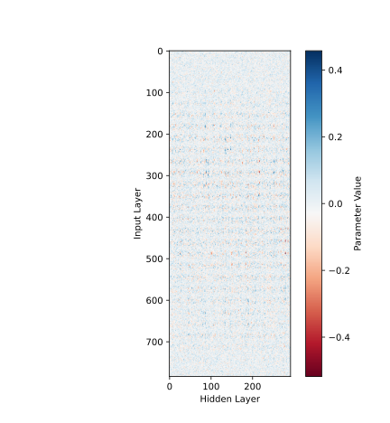

2023 Spring DATA620004 神经网络与深度学习 作业1 构建两层神经网络分类器
===

**陈子健 22110980002**

本项目旨在使用numpy实现一个两层的神经网络（即一个隐藏层一个输出层）并对MNIST数据进行分类。

## 文件和类

1. `accuracy.svg`   模型训练集和测试集的accuracy收敛图示
2. `functions.py`   要用到的函数（含Relu,Sigmoid,Softmax激活函数及其梯度函数和crossentropy损失函数）
3. `layers.py`      构建层的类
   1. `Relu`        Relu激活层
   2. `Sigmoid`     Sigmoid激活层
   3. `Affine`      仿射层
   4. `SoftmaxWithLoss`     输出层
4. `loss_acc_epoch_test.csv`    训练输出的每个epoch结束时训练集和测试集的loss和accuracy列表
5. `loss.svg`       模型训练集和测试集的loss收敛图示
6. `main.py`        主程序
7. `minst.pkl`      下载好的MNIST数据
8. `minst.py`       从`http://yann.lecun.com/exdb/mnist/`下载和加载MNIST数据并对数据进行标准化（本脚本引用自斋藤康毅的 **《深度学习入门》** ）
9. `network.pkl`    以pickle格式保存的训练好的网络
10. `program_output.txt`     该文本文件保存了运行程序后终端输出的信息（包括Random Grid Search每一轮训练的结果和最终最优参数的训练过程）
11. `random_grid_search_results.csv`    random grid search每一轮随机生成的超参数和validation的accuracy
12. `random_grid_search.py` 进行随机网格搜索的函数
13. `save_load.py`  保存和加载训练好的网络
14. `sgd.py`        随机梯度下降的类
15. `shuffle_dataset`   打乱数据以划分随机化的验证集
16. `test.py`       载入训练好的模型并在测试集上测试
17. `trainer.pkl`   以pickle格式保存的最终最优参数训练的类（含network以及训练中用到的超参数以及训练各epoch的loss和accuracy）
18. `trainer.py`    神经网络训练器`Trainer`类
19. `two_layer_net` 两层神经网络的类`TwoLayerNet`（含根据给定的超参数搭建模型、求loss和accuracy以及实现反向传播的函数）
20. `vis_param.py`  载入训练好的模型并对两层参数矩阵W1和W2进行可视化（使用imshow热图）
21. `W1.png`,`W1.svg`,`W2.png`,`W2.svg` 参数矩阵可视化结果

## 执行步骤

1. 运行`main.py`获得收敛两幅图示并生成`network.pkl`以及`trainer.pkl`（可调整里面的注释跳过Random Grid Search直接使用之前的到的最有超参数训练一次）
2. 运行`test.py`加载上一步保存的网络并计算在测试集上的accuracy
3. 运行`vis_param.py`对参数进行可视化

## 运行时间

使用笔记本CPU（Intel i9-12900H）训练在Python 3.11中大约需要运行160分钟（每一轮约3-5分钟，平均每秒迭代80-90次）

## 超参数选择

通过多次尝试为最大化测试集效果并控制训练时间将超参数随机搜索范围设定为：
- 学习率`lr`在0.15和0.25之间；
- L2范数强度`weight_decay`在1e-7和1e-4之间
- 隐藏层宽度`hidden_size`在200和300之间

另外，将batch size设定为128，训练的epoch数量设定为50

## 训练结果

### 超参数搜索

超参数搜索结果如下表

|    | lr                  | weight decay           | hidden size | val acc            |
|----|---------------------|------------------------|-------------|--------------------|
| 0  | 0.24752157219042198 | 2.546591239423651e-07  | 292.0       | 0.98125            |
| 1  | 0.23255567876548894 | 1.2745841714141883e-05 | 267.0       | 0.9811666666666666 |
| 2  | 0.24175048710643954 | 5.361182401599098e-05  | 274.0       | 0.9811666666666666 |
| 3  | 0.22328090001926837 | 1.5403388188196372e-06 | 252.0       | 0.9809166666666667 |
| 4  | 0.2321697273361875  | 4.9305500837501344e-05 | 282.0       | 0.9808333333333333 |
| 5  | 0.18507608789577576 | 9.307791446181603e-07  | 261.0       | 0.9808333333333333 |
| 6  | 0.23109405148026593 | 8.679479475452856e-07  | 288.0       | 0.98025            |
| 7  | 0.22461006163887118 | 8.636323401429165e-05  | 203.0       | 0.9800833333333333 |
| 8  | 0.19113385644168773 | 1.1413191964247618e-05 | 272.0       | 0.98               |
| 9  | 0.21371790467074547 | 1.8556354793309257e-06 | 298.0       | 0.9799166666666667 |
| 10 | 0.23992562999034353 | 3.702868289160991e-05  | 247.0       | 0.9798333333333333 |
| 11 | 0.18381649842356437 | 2.884889172287093e-07  | 282.0       | 0.9798333333333333 |
| 12 | 0.22080974628848576 | 1.0683862872363182e-05 | 288.0       | 0.97975            |
| 13 | 0.19777638323161653 | 3.597378973373474e-06  | 267.0       | 0.9796666666666667 |
| 14 | 0.21084258109746964 | 4.6823909404159266e-07 | 266.0       | 0.9795833333333334 |
| 15 | 0.20321563058874528 | 5.254191417781557e-05  | 219.0       | 0.9795             |
| 16 | 0.19419255056192083 | 3.030606122714532e-05  | 293.0       | 0.9794166666666667 |
| 17 | 0.19207585288966342 | 2.126012025019545e-05  | 266.0       | 0.9794166666666667 |
| 18 | 0.16450902781726337 | 1.0383575185414698e-06 | 200.0       | 0.9794166666666667 |
| 19 | 0.1857659203609815  | 5.010408914873348e-06  | 276.0       | 0.9794166666666667 |
| 20 | 0.18165513212238604 | 2.306371262120434e-05  | 283.0       | 0.9793333333333333 |
| 21 | 0.24313211621261183 | 6.910459108103778e-07  | 210.0       | 0.9793333333333333 |
| 22 | 0.20519539849250934 | 2.8409340238324462e-06 | 290.0       | 0.9793333333333333 |
| 23 | 0.2119173379011831  | 2.8017412358037173e-06 | 257.0       | 0.9793333333333333 |
| 24 | 0.2171426623602652  | 1.2702408109916973e-07 | 277.0       | 0.97925            |
| 25 | 0.21036170787202566 | 2.3600539563461043e-06 | 250.0       | 0.97925            |
| 26 | 0.20779466244641936 | 4.011005520125497e-05  | 242.0       | 0.9790833333333333 |
| 27 | 0.22627234666687873 | 5.348860762402289e-07  | 265.0       | 0.979              |
| 28 | 0.16218459264640836 | 1.574979700981203e-07  | 287.0       | 0.9789166666666667 |
| 29 | 0.21618610895144025 | 2.58283774003811e-07   | 244.0       | 0.9788333333333333 |
| 30 | 0.15919152029137126 | 7.017949997941245e-05  | 201.0       | 0.9788333333333333 |
| 31 | 0.23510932667105677 | 2.616224693430504e-07  | 252.0       | 0.9788333333333333 |
| 32 | 0.2144090287585681  | 2.1120421172697147e-07 | 254.0       | 0.97875            |
| 33 | 0.1566735707963672  | 2.749102284340813e-07  | 203.0       | 0.97875            |
| 34 | 0.19685582454719142 | 1.0737519312173315e-07 | 274.0       | 0.97875            |
| 35 | 0.18675215205482176 | 3.80717328710921e-06   | 210.0       | 0.97875            |
| 36 | 0.15067939589370352 | 6.150481958066011e-06  | 259.0       | 0.9785833333333334 |
| 37 | 0.15561498598609355 | 5.670216873223261e-07  | 234.0       | 0.9785833333333334 |
| 38 | 0.17221346532842546 | 4.6727409715604206e-07 | 210.0       | 0.9785             |
| 39 | 0.17894103521133978 | 3.5268385358389936e-07 | 225.0       | 0.9784166666666667 |
| 40 | 0.18475579015613885 | 2.160710527475682e-07  | 274.0       | 0.9783333333333334 |
| 41 | 0.15451196584598917 | 7.146735028991192e-07  | 256.0       | 0.9783333333333334 |
| 42 | 0.17382499140167024 | 8.462360972669268e-06  | 226.0       | 0.97825            |
| 43 | 0.2273416870177216  | 7.3777829818181854e-06 | 271.0       | 0.9781666666666666 |
| 44 | 0.15753366352522657 | 1.400434612396833e-07  | 236.0       | 0.9780833333333333 |
| 45 | 0.18664858529471506 | 2.3403951922361508e-07 | 207.0       | 0.978              |
| 46 | 0.15504993209393644 | 7.218085702515411e-06  | 208.0       | 0.9779166666666667 |
| 47 | 0.1837956553060056  | 1.1123971947399937e-05 | 272.0       | 0.9778333333333333 |
| 48 | 0.173992725287063   | 1.2550886498731752e-06 | 251.0       | 0.9775833333333334 |
| 49 | 0.16568008320205896 | 8.232293894034082e-07  | 219.0       | 0.97725            |

最终选择的最有超参数为
- `lr = 0.247521572190421` 
- `weight_decay = 2.54659123942365e-07`
- `hidden_size = 293`

事实上，在本项目指定的搜索范围内，大多数超参数选择能把测试集的accuracy控制在98%左右，隐藏层宽度越高，在范围内学习率越大，效果越好。

经过尝试发现，进一步增大隐藏层宽度会增加训练时间，但验证效果基本不会有太大提升，而若使用两个隐藏层甚至三个隐藏层最终测试集的准确率也停留在98.1-98.2%，而训练时间可能提高50%以上，收益不大。

### 最终训练结果

最终得到的模型测试及表现为98.08%（通过观察各epoch训练结果发现还得到过98.19%的结果，说明模型到后面出现了一定程度的过拟合），以下为训练的loss和accuracy的图示（作图时去掉第一个epoch防止出现第一个epoch的loss过高和accuracy过低导致后面的结果在纵轴上基本持平难以辨认）。从loss的收敛图示中也可看出后面一些epoch的test loss略微上升，体现出一定程度的过拟合现象。

#### Loss

#### Accuracy

#### 图中的训练收敛过程详细数据

| epoch | train loss            | test loss           | train acc          | test acc |
|-------|-----------------------|---------------------|--------------------|----------|
| 2.0   | 0.1990523923359118    | 0.1988835606856025  | 0.9423166666666667 | 0.9421   |
| 3.0   | 0.13764715640321828   | 0.14017359736478496 | 0.9605166666666667 | 0.9577   |
| 4.0   | 0.10151592572040824   | 0.11463061511100403 | 0.9716666666666667 | 0.9649   |
| 5.0   | 0.08171387408763639   | 0.0982761290058924  | 0.9772333333333333 | 0.9696   |
| 6.0   | 0.06858077048297348   | 0.08599139694524359 | 0.9813166666666666 | 0.9733   |
| 7.0   | 0.059493251885431885  | 0.08481475252406803 | 0.9842666666666666 | 0.9745   |
| 8.0   | 0.04943714049155802   | 0.07533115429479231 | 0.98695            | 0.9773   |
| 9.0   | 0.043423222352639484  | 0.07572606439253664 | 0.9890833333333333 | 0.9779   |
| 10.0  | 0.03834815612950422   | 0.07149801001064168 | 0.9906666666666667 | 0.9781   |
| 11.0  | 0.036062635779891626  | 0.07258526360529816 | 0.99115            | 0.9781   |
| 12.0  | 0.03178012682161863   | 0.0697030428321737  | 0.99245            | 0.9785   |
| 13.0  | 0.0282412770554851    | 0.0670915998758524  | 0.9938             | 0.9795   |
| 14.0  | 0.025231570805068358  | 0.06692031421327248 | 0.9944833333333334 | 0.979    |
| 15.0  | 0.02228415117488007   | 0.06875069089793559 | 0.9957333333333334 | 0.9799   |
| 16.0  | 0.02065321489936929   | 0.06712997127164871 | 0.9958             | 0.9794   |
| 17.0  | 0.018674226117915638  | 0.0654071387638929  | 0.9965             | 0.9802   |
| 18.0  | 0.016482397867105376  | 0.06514703694469354 | 0.9972             | 0.9801   |
| 19.0  | 0.015631353630743354  | 0.06576368313149168 | 0.9975333333333334 | 0.9798   |
| 20.0  | 0.014344409657685313  | 0.06611702691124302 | 0.99795            | 0.9798   |
| 21.0  | 0.013541514784842697  | 0.06550937014266724 | 0.9980833333333333 | 0.9792   |
| 22.0  | 0.011829399369848061  | 0.06561286247602659 | 0.99835            | 0.9809   |
| 23.0  | 0.01135062071692585   | 0.06540220064489546 | 0.9985166666666667 | 0.9808   |
| 24.0  | 0.009788722031814058  | 0.06524553278067016 | 0.9988333333333334 | 0.9809   |
| 25.0  | 0.009430522908542504  | 0.06499033704239719 | 0.999              | 0.9801   |
| 26.0  | 0.008351875655240813  | 0.0645772582938583  | 0.9992333333333333 | 0.981    |
| 27.0  | 0.007659857234384058  | 0.06444379826726687 | 0.9993333333333333 | 0.9804   |
| 28.0  | 0.007242327646024771  | 0.06661666154270111 | 0.99945            | 0.9802   |
| 29.0  | 0.007033001339541636  | 0.06500511233744033 | 0.9994166666666666 | 0.9816   |
| 30.0  | 0.0061437978933895    | 0.06564664326267788 | 0.9997166666666667 | 0.9814   |
| 31.0  | 0.005869772986830388  | 0.06401209668772019 | 0.9996166666666667 | 0.9812   |
| 32.0  | 0.0056600372815532665 | 0.06692919212436388 | 0.9996833333333334 | 0.9808   |
| 33.0  | 0.005540815944086697  | 0.06587093893849662 | 0.9997333333333334 | 0.981    |
| 34.0  | 0.005073357532047037  | 0.0656205288298405  | 0.9996833333333334 | 0.9805   |
| 35.0  | 0.004819617060007914  | 0.0659755185824975  | 0.9998333333333334 | 0.9804   |
| 36.0  | 0.004655459135069812  | 0.06647403307015355 | 0.9999             | 0.9817   |
| 37.0  | 0.0043084557213740994 | 0.06660465482935342 | 0.9999             | 0.981    |
| 38.0  | 0.004102430184406682  | 0.06695753480236383 | 0.99985            | 0.9813   |
| 39.0  | 0.0039189825089581895 | 0.06804116119968254 | 0.9999333333333333 | 0.9807   |
| 40.0  | 0.003927353674654048  | 0.06847281217565923 | 0.99995            | 0.9819   |
| 41.0  | 0.0036949539081601946 | 0.06776797812705458 | 0.9999666666666667 | 0.9802   |
| 42.0  | 0.0034569743876253656 | 0.06685710754717379 | 0.9999666666666667 | 0.9811   |
| 43.0  | 0.0033686318485235947 | 0.06819277248163727 | 0.99995            | 0.9809   |
| 44.0  | 0.003191550529702927  | 0.06785286030712206 | 0.9999833333333333 | 0.9811   |
| 45.0  | 0.0030534900528952635 | 0.06764850033697609 | 0.9999666666666667 | 0.9811   |
| 46.0  | 0.0029992809469022415 | 0.06796070966349019 | 0.9999833333333333 | 0.9809   |
| 47.0  | 0.00283876652860813   | 0.06810969854075724 | 0.9999833333333333 | 0.9808   |
| 48.0  | 0.002740117495622836  | 0.06882312866499317 | 0.9999833333333333 | 0.9807   |
| 49.0  | 0.0027284348608085777 | 0.0683929339379065  | 0.9999833333333333 | 0.9806   |
| 50.0  | 0.002565100407469506  | 0.06950715262750833 | 1.0                | 0.9813   |

### 参数可视化结果

用`matplotlib.pyplot.imshow`进行简单的参数矩阵可视化

#### $W_1\ (784\times 292)$

#### $W_2\ (292\times 10)$ 

